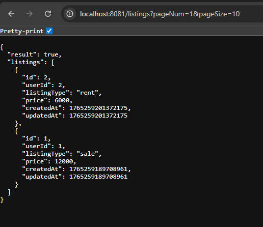
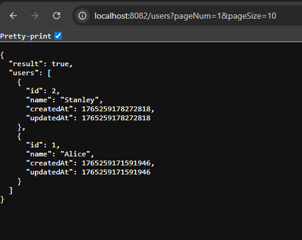
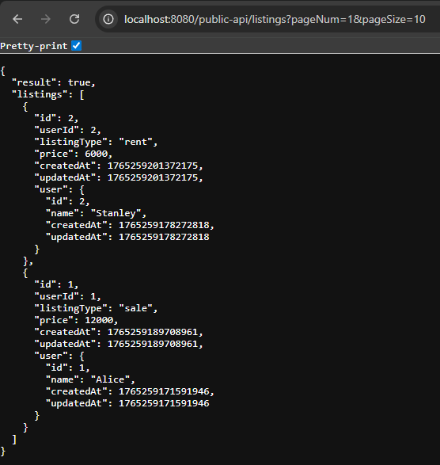

# Microservices

This repository contains the implementation of the technical assignment consisting of:

- **listing-service** (port: 8081)
- **user-service** (port: 8082)
- **public-api** (port: 8080)


---
# How to Run

```bash
cd listing-service
gradlew.bat bootRun
```

```bash
cd user-service
gradlew.bat bootRun
```

```bash
cd public-api
gradlew.bat bootRun
```

---
# Test Result




